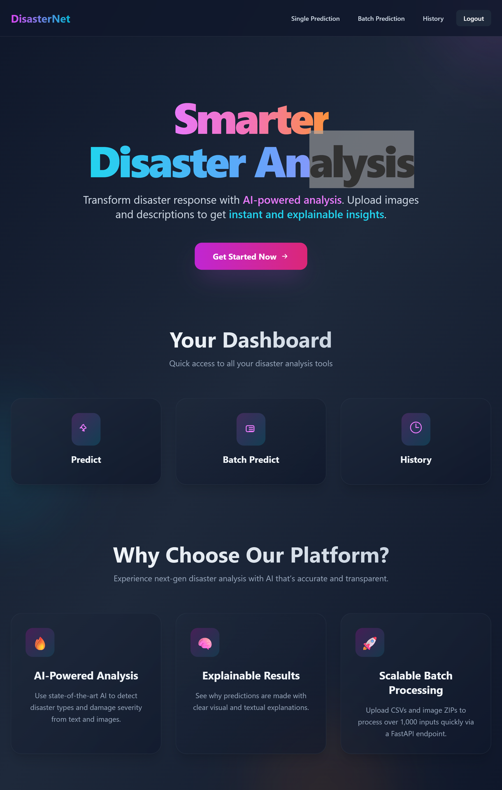
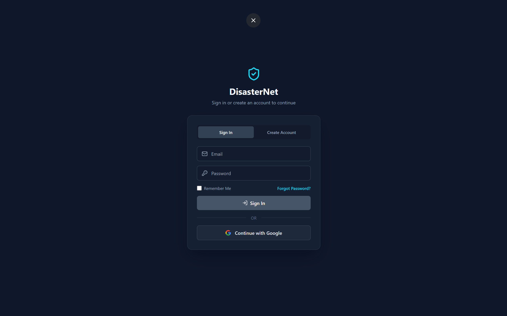
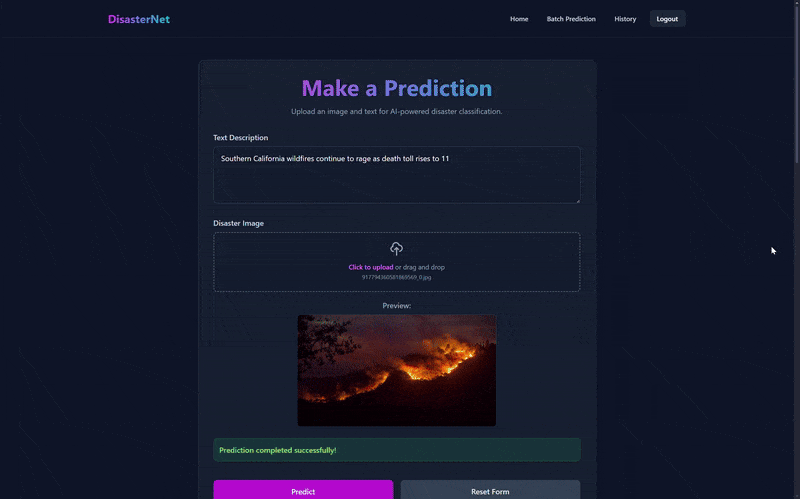
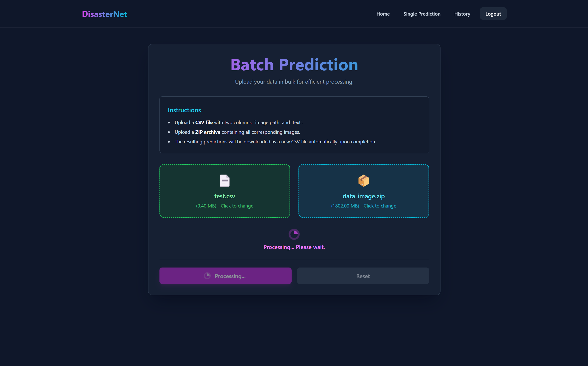
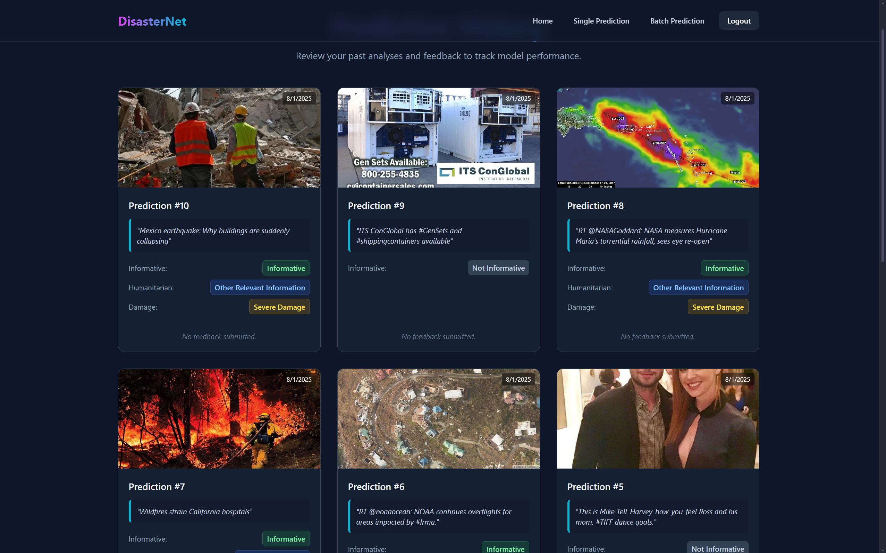

# 🌪️ DisasterNet - Multimodel Disaster Intelligence

            

---
## 📌 Table of Contents
- [Overview](#-overview)
- [Model Architecture](#-model-architecture)
- [Live Demo](#-live-demo)
- [Key Features](#-key-features)
- [UI Overview](#-ui-overview)
- [Project Description](#-project-description)
- [Tech Stack](#-tech-stack)
- [Dataset](#-dataset)
- [Credits](#-credits)
- [License](#-license)

---
## 🌍 Overview

**DisasterNet** is an AI-powered platform for classifying and analyzing social media content during natural disasters. It fuses text and image inputs using a custom multimodal deep learning model to generate actionable insights for humanitarian response teams. By enabling real-time classification, batch analysis, and predictive feedback, DisasterNet helps organizations respond faster and allocate resources more effectively.

---

## 🧠 Model Architecture

DisasterNet uses a **three-stage classification pipeline** trained on the [**CrisisMMD** dataset](https://crisisnlp.qcri.org/crisismmd). Each stage is a custom **PyTorch model** hosted on **Hugging Face** and accessed through the backend via FastAPI:

### 1. Informative Classification (Binary)
Determines whether a post (text + image) is **informative** or **not informative**.

### 2. Humanitarian Category Classification (7 classes)
If the post is informative, it is categorized into one of the following:

- Affected Individuals  
- Infrastructure and Utilities Damage  
- Rescue, Volunteering, or Donation Effort  
- Injured or Dead People  
- Missing or Found People  
- Other Relevant Information  
- Not Humanitarian

### 3. Damage Severity Classification (3 classes)
Estimates the physical damage shown in the image:

- Severe Damage  
- Mild Damage  
- Little or No Damage

Each model uses:
- **BERT** for text encoding  
- **ResNet-50** for image feature extraction  
- A fusion layer followed by a dense classifier

---
## 🌟Live Demo

Experience the app live here: [DisasterNet](https://disaster-net.vercel.app)

---
## ✨ Key Features

| Feature                 | Description                                                                                 |
|-------------------------|---------------------------------------------------------------------------------------------|
| 🔍 Informative Filter     | Filters out non-actionable posts, surfacing only informative content          |
| 🧠 Humanitarian Tagging   | Assigns relevant humanitarian categories to posts          |
| 🏚️ Damage Estimation     | Analyzes image content to assess damage severity     |
| 📂 Batch Prediction      | Supports bulk inference via ZIP (images) + CSV (text/image mapping) upload   |
| 📊 Prediction History    | Stores past inferences with timestamps, inputs, and feedback              |
| ✅ Feedback Mechanism     | Users can flag predictions as correct or incorrect to guide future model improvements      |
| 🔐 Secure Auth           | Firebase-based Email/Password and Google login with verification and persistent sessions  |

---
## 🖥️ UI Overview

- **🏠 Home Page**  
  Introduces the platform and its benefits. The UI dynamically adapts for guest and authenticated users. 
  

- **🔐 Login Page**  
  Supports both Email/Password and Google login. Features email verification and session persistence.
  

- **⚙️ Prediction Page**  
  Upload an image and a short description. The AI performs multimodal classification and allows user feedback.
  

- **📂 Batch Prediction Page**  
  Upload a ZIP of images and a CSV mapping texts to image filenames for bulk classification. 
  

- **📊 History Page**  
  Browse your past predictions with full metadata, labels, and feedback status.
  

  ---

## 🧾 Project Description

  DisasterNet is an intelligent, multimodal disaster response platform that empowers responders by:

- 🧠 Identifying informative vs. non-informative social media posts  
- 📌 Categorizing informative posts into humanitarian action categories  
- 🏚️ Estimating visual damage severity in shared images  
- 📂 Allowing bulk processing through batch uploads  
- 🔁 Logging predictions and feedback for continuous improvement
---

## ⚙️ Tech Stack

| Layer          | Technologies                                      |
|----------------|--------------------------------------------------|
| 🌐 Frontend    | React, Tailwind CSS                             |
| ⚙️ Backend     | FastAPI, Pydantic, Uvicorn, Hugging Face Hub       |
| 🤖 AI          | PyTorch, BERT(HuggingFace), ResNet50(TorchVision) |
| 🧠 Models      | 3 Hosted Hugging Face Models                      |
| 🗃️ Storage      | PostgreSQL                                      |
| 🔐 Auth	         | Firebase Authentication (Email/Password + Google Sign-In)|

---

## 📚 Dataset

The platform is trained on the [**CrisisMMD** dataset](https://crisisnlp.qcri.org/crisismmd), a multilingual, multimodal dataset of disaster-related tweets annotated for informativeness, humanitarian category, and damage severity.

---
## 🙌 Credits

Built with ❤️ by **PritkumarPagda**

---
## 📄 License

This project is licensed under the **MIT License** — see the [LICENSE](LICENSE) file for details.

---
