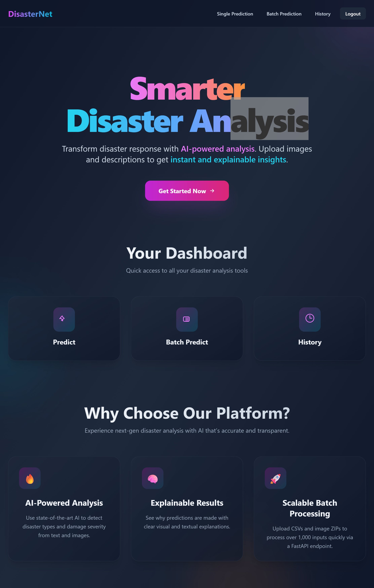
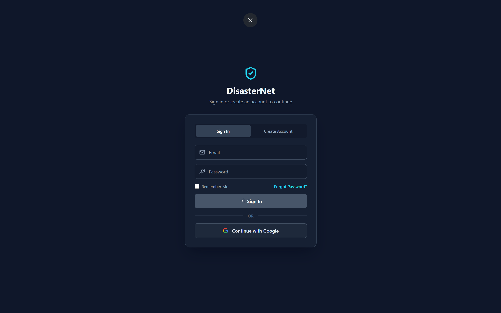
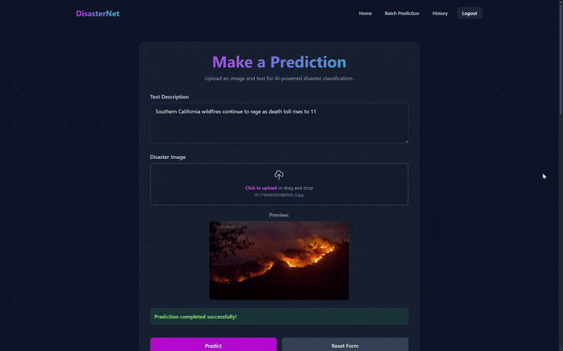
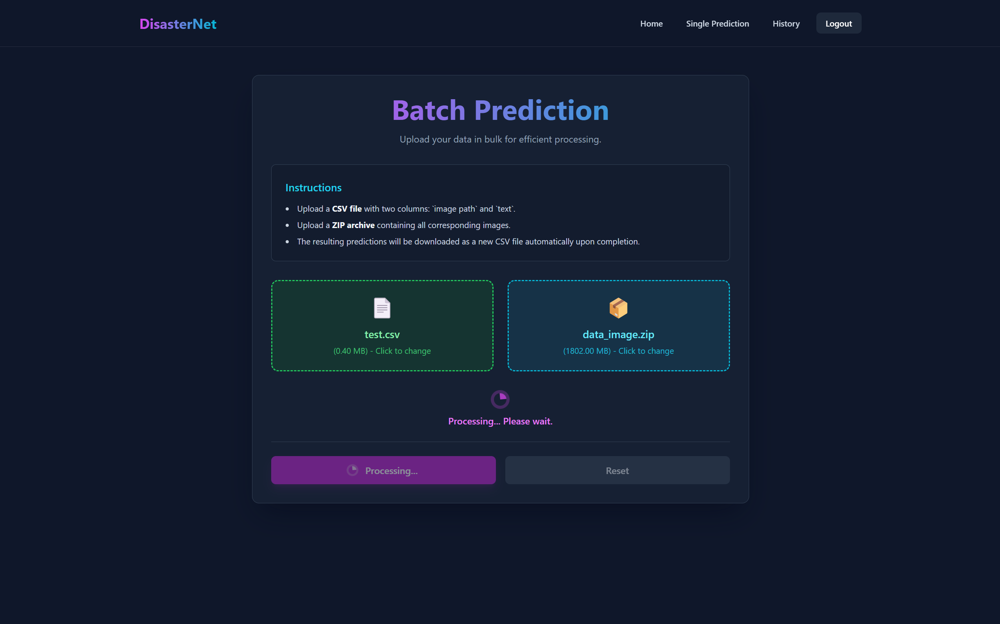
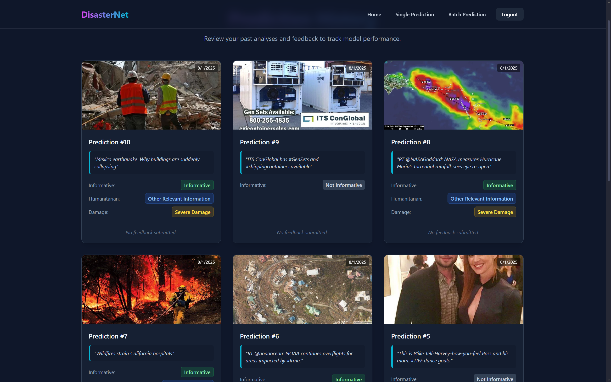

# 🌪️ DisasterNet - Multimodel Disaster Intelligence

   
      


---
## Overview

**DisasterNet** is an end-to-end deep learning application designed to rapidly classify social media posts during natural disasters. By fusing text and image data, it provides critical intelligence to humanitarian organizations, helping them assess damage and allocate resources more effectively.

---
## 🌟Live Demo

Experience the app live here: [DisasterNet](https://disaster-net.vercel.app)

---
## 🖥️ Demo Pages

- **🏠 Home Page**  
  Overview of the platform with a call to action, key features, and dynamic Ul tailored for both new and logged-in users.
  

- **🔐 Login Page**  
  Email/password & Google sign-in with email verification and “Remember Me.” Smooth tabs and feedback alerts.
  

- **⚙️ Prediction Page**  
  Upload a disaster-related image and description for Al-driven classification and explanation, with options for user feedback on prediction accuracy.
  

- **⏱️ Batch Prediction Page**  
  Input 
  

- **📊 History Page**  
  Get comprehensive AI recommendations for race strategy, pit stops, and tire choices.
  

  ---

  ##🧾 Project Description

  F1 Strategy AI is a powerful, easy-to-use platform that enables users to:

- ⏱️ **Predict lap times** with detailed input on tire compound, stint, lap number, tire wear, track & air conditions — accurate to within 0.5 seconds.  
- 📊 **Analyze race strategies** using AI-driven recommendations for optimal pit stops and tire changes based on current and historical data via FastF1 telemetry.  
- ⚙️ **Train custom AI models** by refining them on race-specific historical data to improve track and driver-specific predictions.

---

## ✨ Key Features

| Feature                 | Description                                                                                 |
|-------------------------|---------------------------------------------------------------------------------------------|
| ⏱️ Lap Time Prediction  | Predict lap times considering tire compound, stint, lap number, tire life, and weather.     |
| 📊 Strategy Analysis    | Receive adaptive, AI-driven pit stop and tire strategy recommendations for dynamic races.  |
| ⚙️ AI Model Training Hub| Train or refine machine learning models with historical race datasets for better accuracy. |
| 🚀 High-Performance API | FastAPI backend with asynchronous processing for efficient, scalable AI model operations.  |
| 🌐 Modern Frontend      | Responsive React + Tailwind CSS frontend built with Vite for fast and smooth UX.            |

---

## 🛠 Installation(For Local Development)

### 1. Clone the Repository

```bash
git clone https://github.com/pritpagda/DisasterNet.git
cd DisasterNet
```

### 2. Backend Setup (FastAPI)

```bash
cd backend
python3 -m venv venv
# Windows
venv\Scripts\activate
# macOS/Linux
source venv/bin/activate

pip install -r requirements.txt
```

Create a `.env` file in the `backend` folder and add your environment variables:

```
GEMINI_API_KEY=your_api_key_here
ALLOWED_ORIGINS=http://localhost:3000
```

Start the backend server:

```bash
uvicorn main:app --reload
```

### 3. Frontend Setup (React + TailwindCSS + Vite)

```bash
cd ../frontend
npm install
```
Create a `.env` file in the `frontend` folder and add your environment variables:

```
REACT_APP_URL=http://127.0.0.1:8000
```
Start the React development server:
```
npm start
```
### 4. Access the Application
Open your browser and go to: [http://localhost:3000](http://localhost:3000)

---

## 🧪 How to Use F1 Strategy AI

1. **Train Custom Model:** Select race year and event to train/refine AI models for tailored, accurate predictions.  
2. **Lap Time Prediction:** Input race and environmental parameters for precise lap time forecasts.  
3. **Strategy Analysis:** Get AI-driven recommendations on pit stops, tire strategies, and race tactics based on live and historical data.

---

## ⚙️ Tech Stack Overview

| Layer          | Technologies                                      |
|----------------|--------------------------------------------------|
| 🌐 Frontend    | React, Tailwind CSS, Vite                         |
| ⚙️ Backend     | FastAPI, Pydantic, Uvicorn (ASGI server)         |
| 🤖 AI Layer    | Gemini API (Google Generative AI), Scikit-learn, Pandas, joblib |

---
## Credits

Built with ❤️ by **PritkumarPagda**

---
## 📄 License

This project is licensed under the **MIT License** — see the [LICENSE](LICENSE) file for details.

---
